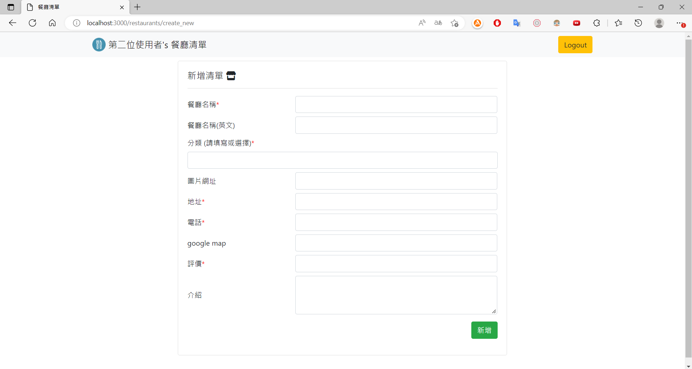
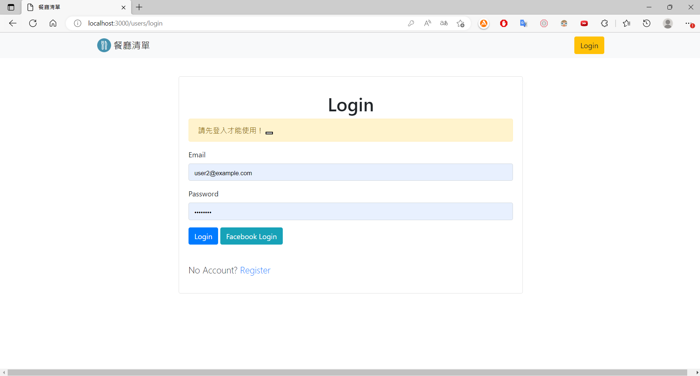
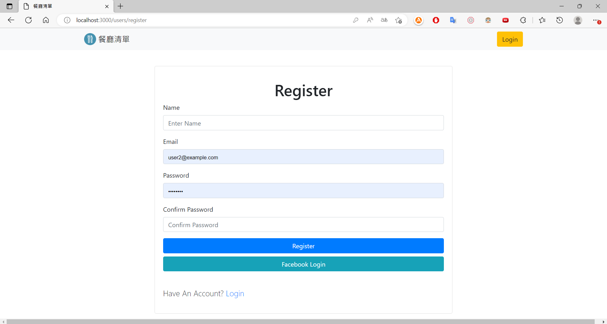

# 我的餐廳清單

使用者須先註冊，登入後可以建立自己專屬的餐廳清單。
包含新增、修改、排序及查詢功能。
清單內容可以查看類別、餐廳簡介、地址、電話，及評分資訊等。

---

## 專案畫面

### 餐廳清單


### 新增清單



### 登入畫面



### 註冊畫面



---

## 環境建置與需求 (prerequisites)

- Node.js 14.16.0
- Express 4.16.4
- Express-handlebars 3.0.0
- Bootstrap 4.3.1
- Font-awesome 6.2.0
- Mongoose 5.9.7
- method-override 3.0.0
- bcryptjs 2.4.3
- connect-flash 0.1.1
- dotenv 8.2.0
- express-session 1.17.1
- passport 0.4.1
- passport-facebook 3.0.0
- passport-local 1.0.0

## 使用說明

1. 請先確認有安裝 node.js 與 npm
2. 透過終端機，Clone 此專案至本機電腦

   ```bash
   git clone https://github.com/linway035/restaurant.git
   ```

3. 透過終端機，cd 至存放的資料夾
4. 啟動伺服器，執行 app.js 檔案
   ```bash
    nodemon app.js
   ```
5. 成功連結後，開啟任一瀏覽器瀏覽器輸入 http://localhost:3000/ 開始使用

## 網站功能介紹

- 需註冊後才能使用，可使用 Facebook 註冊
- 卡片式清單，包含餐廳照片、名稱及評分
- 搜尋欄可透過餐廳名稱或餐品種類搜尋
- 點選店家後，可以瀏覽詳細資訊
- 新增、修改，及移除清單項目
- 選擇排序方式
